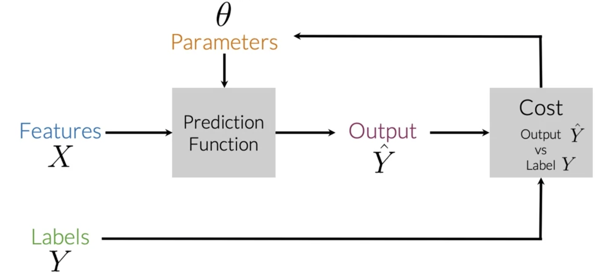
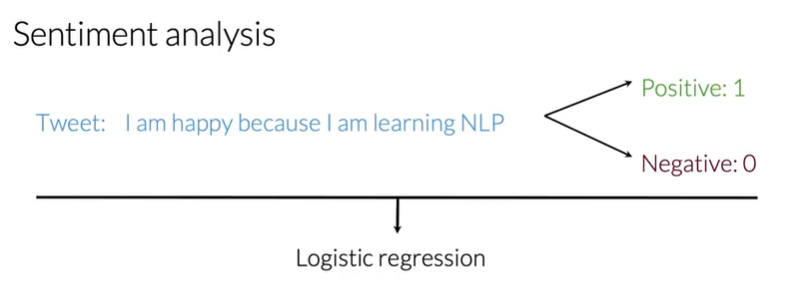
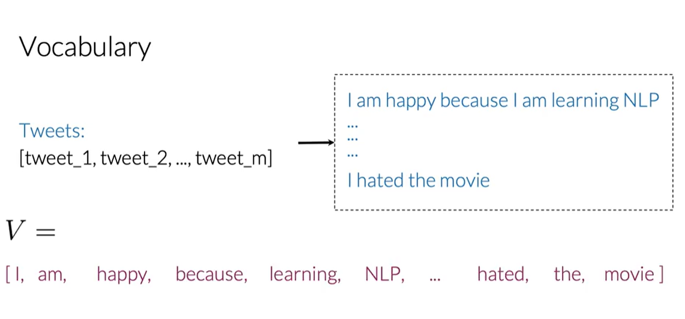
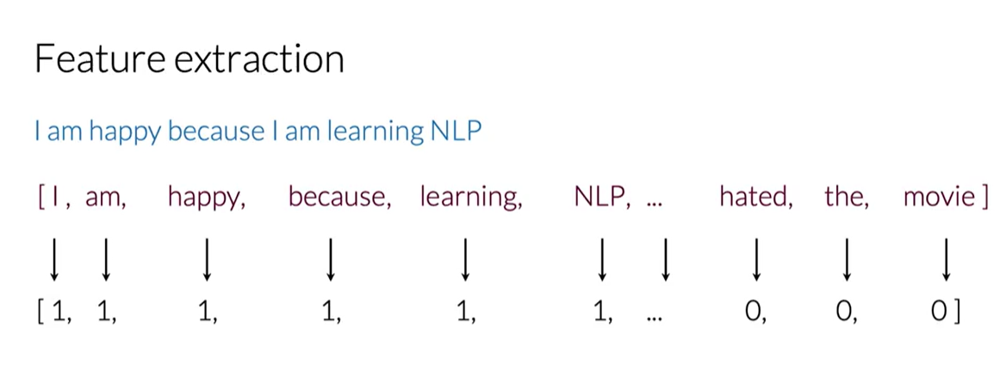
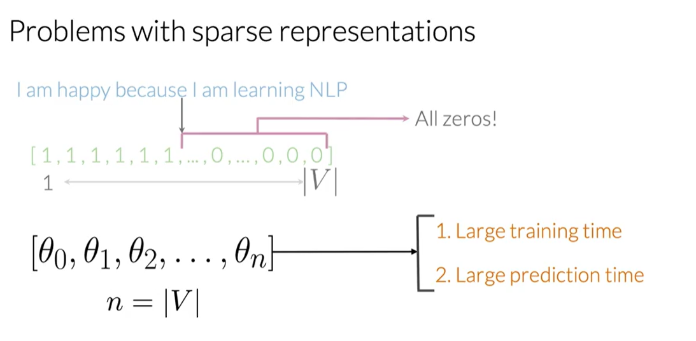
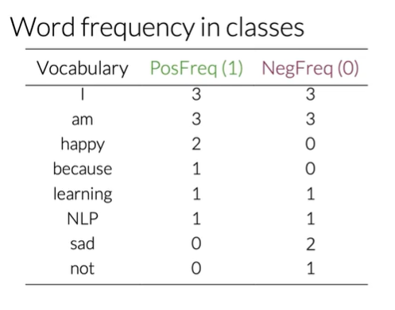

The first course will talk about the calculus of a good or negative sentiment about a word in a sample text.
We will make our first translation system and make use of 'locality sensitive hashing' to improve the performance of  
nearest neighbor search.

Logistic regression is a good model because it's easy to train, we will use it to analyze sentiments.

# Supervised ML & Sentiment Analysis

Supervised ML is : features X, labels Y.  
Goal is to minimize our cost using for example gradient descent. We reach this goal when the expected value Y and the predicted value Y hat is minimized.

For example, this tweet : I am happy because I am learning NLP  
To define if it is a Positive:1 or Negative:0 class, we will use logistic regression.

There is the way to do.  
First, we to extract meaningful features. (Here, the tweet is the feature X) -> Next, training the classifier minimizing the cost. -> Then, classify the tweet.

0 : negative sentiment  
1 : positive sentiment

# Vocab & Feature Extraction

## Vocab

Here, we will see how can we represent a text as a vector  
The way is to build a vocabulary, so we could encode any text as an array of number called vector 

For our tweet for example, there is how it works : 

Tweets[] is the array of all tweets we can have.  
V (vocabulary) array represent the vocabulary of these tweets, it's like each word of all tweets will be in V. But a word is not repeted > 1 time.

## Feature extract & sparse representation

For our example tweet, we will create a feature vector by checking for the presence of each word from our vocabulary (V) in that tweet.  

1 : the word appears in our tweet
0 : the word not appears in our tweet

That's called a SPARSE representation.

Sparse representation size is equal to our whole V. That's mean we could have a lot of zeros.
In logistic regression, model will train on n+1 parameters, with n equal to V size.  
Care, for remember, V size is count of unique word in the tweets array for example here.

The problem is : for large vocalubary array, we could get too much large training time !

# Negative & positive freq

We create a frequency directionnary, with PosFreq and NegFreq, which maps a word to a number of time that word shows up.
Then, we can compare these 2 features. That's how we could measure positive & negative frequency.

