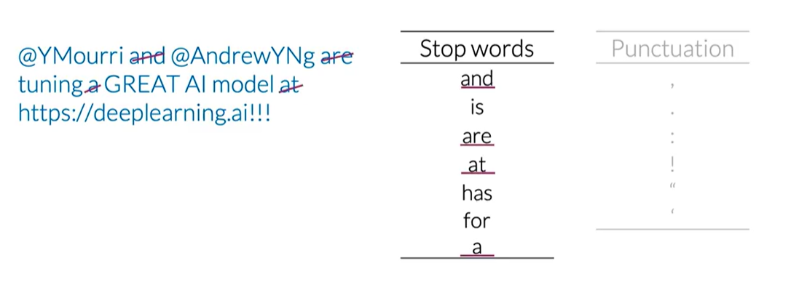

My goal in this section is to build a sentiment analysis model using Logistic Regression. This model will classify tweets as either positive or negative.

  

# 1. The Supervised Learning Framework

The core idea is to train a model using labeled data. In our case, the features `X` are the tweets, and the labels `Y` are their sentiments (1 for positive, 0 for negative).

The training process is an iterative loop:
1.  Input features `X` into a prediction function.
2.  The function, using its current parameters `θ`, generates a prediction $\hat{Y}$.
3.  We calculate the `Cost`, which measures how far $\hat{Y}$ is from the actual label $Y$.
4.  We adjust the parameters `θ` (using an optimizer like Gradient Descent) to minimize this cost.

  

# 2. Feature Extraction: From Text to Numbers

A model can't understand raw text. We need to convert each tweet into a numerical vector.

  

### 2.1. Method 1: Sparse Representation (Bag of Words)

The most straightforward way is to create a feature vector for each tweet based on a vocabulary `V` (the set of all unique words across all tweets, our corpus).

For a single tweet, the feature vector `x` would have the size of `V`. Each element of `x` is 1 if the corresponding word from `V` is in the tweet, and 0 otherwise.

  

This is called a **sparse representation** because for a large vocabulary, the vector will be mostly zeros.

**Problem**: If `V` contains 10,000 words, our model needs to train on 10,001 parameters (`n+1`, where `n` is the size of `V` and `+1` is for the bias term). This can be computationally very expensive.

  

### 2.2. Method 2: Feature Engineering with Word Frequencies

To avoid large vectors, we can engineer more meaningful features. Instead of a huge sparse vector, we can represent each tweet with a dense vector of only 3 features.

First, we pre-calculate a frequency map (`freqs`) for every word in our vocabulary `V`. This map stores how many times each word appears in positive tweets versus negative tweets.

  

Now, for any given tweet `m`, we can build its feature vector $x_m$ as follows:

1.  **Feature 1 (Bias Unit)**: Always `1`.
2.  **Feature 2 (Positive Score)**: The sum of the positive frequencies for every unique word in the tweet.
3.  **Feature 3 (Negative Score)**: The sum of the negative frequencies for every unique word in the tweet.

  

  

This transforms a long, sparse vector into a very small, dense vector like `[1, 8, 11]`, which is much more efficient for training.

  

# 3. Text Preprocessing

To get meaningful features, we must clean the raw text first. The goal is to reduce noise and standardize the words.

1.  **Remove Noise**: Get rid of elements that don't carry sentiment, like Twitter handles (`@user`), URLs, and retweet markers (`RT`).

    

      
    

2.  **Tokenize**: Split the text into a list of individual words (tokens).
3.  **Remove Stop Words and Punctuation**: Filter out common words (`a`, `the`, `is`) and punctuation that don't add meaning. *Note: This step is context-dependent. For sentiment analysis, emoticons like `:)` are valuable and should be kept.*

    

      
    

4.  **Stemming**: Reduce words to their root form (e.g., `learning`, `learned` -> `learn`). This helps group related words, reducing the vocabulary size.

    

      
    

5.  **Lowercasing**: Convert all text to lowercase to treat words like `Great` and `great` as the same token.

    

      
    

After these steps, a raw tweet is transformed into a clean list of tokens, ready for feature extraction.

  

  

# 4. Building the Feature Matrix

The final step is to apply this process to our entire corpus of tweets. Each tweet is converted into its 3-feature vector. These vectors are then stacked together to form a single matrix `X`.

Each row in the matrix `X` represents a tweet, and each column represents a feature. This matrix, along with the corresponding label vector `Y`, is what we'll use to train our logistic regression model.

  

  

# 5. Logistic Regression for Classification

After extracting features, the next step is to build a model that can classify a tweet as positive or negative. For this, we use Logistic Regression, a classification algorithm that predicts a probability.

### 5.1. The Hypothesis Function

The core of logistic regression is the **hypothesis function**, denoted as $h(x)$, which estimates the probability that the output is 1. In our case, it's the probability of a tweet being positive.

The hypothesis is defined using the **sigmoid function**, $g(z)$:
$$h(x) = g(\theta^T x)$$
Where:
- $\theta$ is the vector of model parameters (weights).
- $x$ is the feature vector.
- $\theta^T x$ is the dot product of the parameters and features.

The sigmoid function is defined as:
$$g(z) = \frac{1}{1 + e^{-z}}$$
This function always outputs a value between 0 and 1, which is perfect for representing a probability.

  

  

  

### 5.2. The Decision Boundary

To make a final classification (0 or 1), we need a threshold. By convention, we use 0.5:
- If $h(x) \ge 0.5$, we predict **positive sentiment** (Y=1).
- If $h(x) < 0.5$, we predict **negative sentiment** (Y=0).

Looking at the sigmoid plot, $g(z) \ge 0.5$ when its input $z \ge 0$. Since our input is $z = \theta^T x$, this means:
$$\theta^T x \ge 0 \implies \text{Predict Positive}$$
$$\theta^T x < 0 \implies \text{Predict Negative}$$

The line defined by $\theta^T x = 0$ is called the **decision boundary**. It's the line that separates the two predicted classes.

### 5.3. Training the Model

The goal of training is to find the optimal parameters $\theta$ that minimize the difference between our predictions ($\hat{Y}$) and the actual labels ($Y$). This is achieved by minimizing a **cost function** using an optimization algorithm like Gradient Descent.

  

### 5.4. Example Walkthrough

Let's assume we have already trained our model and found the optimal parameters $\theta$. Now, we can predict the sentiment of a new tweet.

1.  **Preprocessing**: The raw tweet is cleaned (lowercased, tokenized, stopwords removed, stemmed).
2.  **Feature Extraction**: We create the feature vector $x$ using the word frequency method.
3.  **Prediction**: We compute the dot product $\theta^T x$ and apply the sigmoid function to get the probability.

  

In this example, the dot product $\theta^T x$ is 4.92.
$$h(x) = g(4.92) = \frac{1}{1 + e^{-4.92}} \approx 0.993$$
Since $0.993 \ge 0.5$, the model correctly predicts a **positive sentiment**.

### 5.5. Logistic Regression Training: Gradient Descent

To train a logistic regression classifier, we need to find the optimal parameters, $\theta$, that minimize the **cost function**, $J(\theta)$. This iterative process is carried out using the **Gradient Descent** algorithm.

  

Here's how the process works:

1.  **Initialize Parameters**: Start by initializing the parameters $\theta$ with arbitrary values, typically zeros.

2.  **Calculate Prediction**: For each observation, compute the prediction, $h_\theta(x^{(i)})$, using the sigmoid function and the current parameters.

3.  **Calculate the Gradient**: Compute the gradient of the cost function with respect to each parameter $\theta_j$. The gradient indicates the direction and magnitude of the steepest ascent of the cost function. Our goal is to move in the opposite direction.

4.  **Update Parameters**: Update the parameters by subtracting a fraction of the gradient. The learning rate, $\alpha$, controls the size of each step.

    $\theta_j := \theta_j - \alpha \frac{\partial}{\partial \theta_j} J(\theta)$

5.  **Iterate**: Repeat steps 2 through 4 until convergence is reached. This occurs when the cost function no longer decreases significantly. At this point, we have found the parameters that minimize the cost function, allowing for the most accurate predictions possible.

  

# 6. Evaluating the Model

Once the model is trained, we need to evaluate its performance on data it has never seen before. This process tells us how well our model **generalizes** to new, real-world examples. For this, we use a **validation set** (or test set) composed of a feature matrix $X_{val}$ and a label vector $Y_{val}$.

### 6.1. Generating Predictions on the Validation Set

The first step is to use our trained parameters $\theta$ to make predictions on the validation data.

1.  **Compute Probabilities**: We feed the validation feature matrix $X_{val}$ into our hypothesis function. This computes the predicted probability for each tweet in the validation set.
    $$\hat{P}_{val} = g(X_{val} \theta)$$
    The result, $\hat{P}_{val}$, is a vector of probabilities, where each element is between 0 and 1.

    

      
    

2.  **Apply the Decision Boundary**: To get a final class label (0 or 1), we apply our 0.5 threshold to the probability vector.
    $$y_{pred} = (\hat{P}_{val} \ge 0.5)$$
    This operation creates a new vector, `y_pred`, populated with 0s and 1s, representing the model's final prediction for each tweet (0 for negative, 1 for positive).

    

      
    

### 6.2. Measuring Performance with Accuracy

Now that we have a prediction vector `y_pred`, we can compare it to the true labels in $Y_{val}$ to calculate the model's accuracy.

**Accuracy** is the proportion of predictions that the model got correct.

1.  **Compare Predictions to True Labels**: We perform an element-wise comparison between our prediction vector `y_pred` and the true label vector $Y_{val}$. This results in a vector of booleans (True/False) or integers (1/0), where a `1` indicates a correct prediction and a `0` indicates an error.

    

      
    

    
    For example, if `y_pred = [0, 1, 1]` and `Y_val = [0, 0, 1]`, the comparison yields `[1, 0, 1]`.

    

      
    

2.  **Calculate the Accuracy Score**: The accuracy is the sum of the correct predictions divided by the total number of examples.
    $$\text{Accuracy} = \frac{\text{Number of Correct Predictions}}{\text{Total Number of Predictions}} = \frac{\sum_{i=1}^{m} (y_{pred}^{(i)} == y_{val}^{(i)})}{m}$$
    Where $m$ is the number of examples in the validation set.

    For example, if we had 4 correct predictions out of 5 total tweets, the accuracy would be:
    $$\text{Accuracy} = \frac{4}{5} = 0.8$$
    This means the model has an **80% accuracy** on the validation set.

### 6.3. A Note on Data Splitting

To ensure an unbiased evaluation, the dataset is typically split into three parts before training begins:

* **Training Set**: The largest portion of the data (e.g., 80%), used to train the model and find the optimal parameters $\theta$.
* **Validation Set**: A smaller portion (e.g., 10%), used to evaluate the model during development and tune hyperparameters (like the learning rate). The accuracy we calculated above is on this set.
* **Test Set**: A final, held-out portion (e.g., 10%) that the model never sees during training or tuning. This set is used only once at the very end to provide a final, unbiased measure of the model's real-world performance.

A common split is 80% for training, 10% for validation, and 10% for testing.
