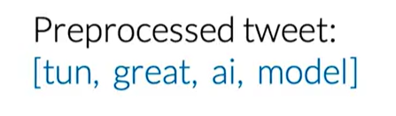

My goal in this section is to build a sentiment analysis model using Logistic Regression. This model will classify tweets as either positive or negative.

# 1. The Supervised Learning Framework

The core idea is to train a model using labeled data. In our case, the features `X` are the tweets, and the labels `Y` are their sentiments (1 for positive, 0 for negative).

The training process is an iterative loop:
1.  Input features `X` into a prediction function.
2.  The function, using its current parameters `θ`, generates a prediction `Ŷ`.
3.  We calculate the `Cost`, which measures how far `Ŷ` is from the actual label `Y`.
4.  We adjust the parameters `θ` (using an optimizer like Gradient Descent) to minimize this cost.

# 2. Feature Extraction: From Text to Numbers

A model can't understand raw text. We need to convert each tweet into a numerical vector.

### Method 1: Sparse Representation (Bag of Words)

The most straightforward way is to create a feature vector for each tweet based on a vocabulary `V` (the set of all unique words across all tweets, our corpus).

For a single tweet, the feature vector `x` would have the size of `V`. Each element of `x` is 1 if the corresponding word from `V` is in the tweet, and 0 otherwise.

This is called a **sparse representation** because for a large vocabulary, the vector will be mostly zeros.

**Problem**: If `V` contains 10,000 words, our model needs to train on 10,001 parameters (`n+1`, where `n` is the size of `V` and `+1` is for the bias term). This can be computationally very expensive.

### Method 2: Feature Engineering with Word Frequencies

To avoid large vectors, we can engineer more meaningful features. Instead of a huge sparse vector, we can represent each tweet with a dense vector of only 3 features.

First, we pre-calculate a frequency map (`freqs`) for every word in our vocabulary `V`. This map stores how many times each word appears in positive tweets versus negative tweets.

Now, for any given tweet `m`, we can build its feature vector `Xm` as follows:

1.  **Feature 1 (Bias Unit)**: Always `1`.
2.  **Feature 2 (Positive Score)**: The sum of the positive frequencies for every unique word in the tweet.
3.  **Feature 3 (Negative Score)**: The sum of the negative frequencies for every unique word in the tweet.

This transforms a long, sparse vector into a very small, dense vector like `[1, 8, 11]`, which is much more efficient for training.

# 3. Text Preprocessing

To get meaningful features, we must clean the raw text first. The goal is to reduce noise and standardize the words.

1.  **Remove Noise**: Get rid of elements that don't carry sentiment, like Twitter handles (`@user`), URLs, and retweet markers (`RT`).
2.  **Tokenize**: Split the text into a list of individual words (tokens).
3.  **Remove Stop Words and Punctuation**: Filter out common words (`a`, `the`, `is`) and punctuation that don't add meaning. *Note: This step is context-dependent. For sentiment analysis, emoticons like `:)` are valuable and should be kept.*
4.  **Stemming**: Reduce words to their root form (e.g., `learning`, `learned` -> `learn`). This helps group related words, reducing the vocabulary size.
5.  **Lowercasing**: Convert all text to lowercase to treat words like `Great` and `great` as the same token.

After these steps, a raw tweet is transformed into a clean list of tokens, ready for feature extraction.

# 4. Building the Feature Matrix

The final step is to apply this process to our entire corpus of tweets. Each tweet is converted into its 3-feature vector. These vectors are then stacked together to form a single matrix `X`.

Each row in the matrix `X` represents a tweet, and each column represents a feature. This matrix, along with the corresponding label vector `Y`, is what we'll use to train our logistic regression model.

