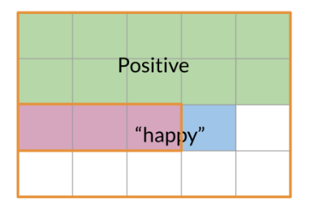

In this module, i will learn a new method for classification called Naive Bayes.
Is it really useful because it's easy to train and provide quick baseline for our tasks.

# 1. Probability & Baye's rule

# 1.1 Conditionnal probabilities

Baye's rule is applied on many field including medecin, education, ...  
Imagine that we want to compute the probability of having a positive tweet on a corpus of tweets.

A = Positive tweet, we have to calcul P(A).  
- P(A) = Npos / N = 13/20 = 0.65 (65%)  
- P(Negative) = 1-P(Positive) = 0.35 (35%)

But, there is a thing we have to care : conditonnal propabilities.  
Its the way that a word considered as positive, can appears on a negative tweets.  

Here, the word happy appears to be positive, but it can appaears on negative tweets.  
For this, we first have to compute the total number of tweets that contains "happy" as B.

P(B) = P(happy) = Nhappy/N
P(B) = 4 / 20 = 0.2

Another way to looking at it :  

So to compute the probability of 2 events happening : "happy" & "positive", we have to look at the intersection of both : happy n positive = 15%

# 2 Bayes' rule 

In fact, conditionnal probas reduce the sample search space.
EXAMPLE : we know the word is happy.

Assuming we have : 
- P(Positive n "happy") as red circle  
- P("happy") as blue circle

Then, :
P(Positive|"happy") = P(Position n "happy") / P("happy)  
or
P(X|Y) = P(Y|X)P(X) / P(Y)

# 3 Naive Bayes model

# 3.1 Data prep for naive bayes

The first step is to compute a freq dic like logistic regression.
With appearance count of Pos & Neg Words

# 3.2 Calculating conditional prob

Its allow us to compute the frequency of each words by 
divide each word appears count by the appearance of all his class, to complete the table ofconditionnal probabilities

With class = Pos or Neg.
If we sum all freq values, we get 1.

What is interesting here, its to clearly see which words are most importants on the classification with signficicant difference between Pos & Neg freq of a word.

Note : when a word class = 0, their are no way to compare across corpus.
To avoid this we will smooth our prob function, so we could compute a likelihood score (= an approximative way to classify)

Note : retire the neutral words Freq(Pos/Neg = 1).  
From here, a score > 1 indicates that the class is positive, either negative.

# 4. Laplacian smoothing

# 4.1

Sometimes, we want to calculate the probabilities for a word to appears after a word. To do that, we logicaly calculate the number of time the words showed up one after another divided by the number of appearance of the first word.

It's what we did on the previous part (smoothing) to avoid a probability of 0.

The expression to calculate a conditionnal probability of a words is : 

With :  
- Nclass = frequency of all words in class
- Vclass = number of unique words in class
- class belongs to {Positive, Negative}

So to avoid prob = 0, we will add 1 on the numerator.  
However, its add a new term of freq() that is not normalized by Nclass.
To account for this, we add the Vclass on the denominator. That si the nb of unique words in our vocabulary.

So now all the prob in each column will sum to one.  

This process is called : Laplacian smoothing !

# 4.2

First,  
Calculate the probabilities of each word in the positive class.  
There is the calculus :  

