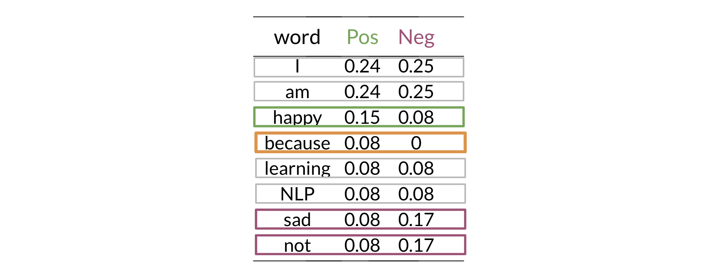

In this section, I will build a sentiment analysis model using a new classification method: **Naive Bayes**. This technique is particularly useful as it is simple to implement, fast to train, and provides a strong baseline for text classification tasks.

Unlike logistic regression, which finds a separating line between classes, Naive Bayes works by calculating the probability of a tweet belonging to the positive or negative class and then selecting the class with the highest probability.

# 1. The Foundation: Bayes' Rule

At the heart of this method is Bayes' Rule, which is a way of updating our beliefs based on new evidence. It relies on conditional probabilities.

### 1.1. Conditional Probability

A conditional probability answers the question: "What is the probability of event A happening, *given that* event B has already happened?" This is written as $P(A|B)$.

For example, what is the probability that a tweet is positive, given that it contains the word "happy"? We can visualize this by looking at the intersection of events. The conditional probability reduces our sample space from all tweets to only the tweets containing the word "happy".

The formula for conditional probability is:
$$ P(A|B) = \frac{P(A \cap B)}{P(B)} $$
Where $P(A \cap B)$ is the probability of both A and B happening.

### 1.2. Bayes' Rule

Bayes' Rule is derived from the conditional probability formula and allows us to "flip" the condition:
$$ P(A|B) = \frac{P(B|A)P(A)}{P(B)} $$
This is a powerful tool because it's often easier to calculate $P(B|A)$ than $P(A|B)$.

# 2. Naive Bayes for Sentiment Analysis

To classify a tweet, I want to determine if it's more likely to be positive or negative. I can frame this using Bayes' Rule. I want to compare:
- $P(\text{positive} | \text{tweet})$
- $P(\text{negative} | \text{tweet})$

Let's focus on the positive case. According to Bayes' Rule:
$$ P(\text{pos} | \text{tweet}) = \frac{P(\text{tweet} | \text{pos}) P(\text{pos})}{P(\text{tweet})} $$

- $P(\text{pos} | \text{tweet})$ is the **posterior probability**: the probability that the tweet is positive given its content. This is what I want to calculate.
- $P(\text{tweet} | \text{pos})$ is the **likelihood**: the probability of observing this specific tweet, given that it belongs to the positive class.
- $P(\text{pos})$ is the **prior probability**: the overall probability of any tweet being positive, based on my training data.
- $P(\text{tweet})$ is the **marginal probability**: the overall probability of observing this tweet.

When comparing the positive and negative classes for the same tweet, the denominator $P(\text{tweet})$ is the same for both. Therefore, I can ignore it and just compare the numerators:
$$ \text{classification} \propto P(\text{tweet} | \text{class}) P(\text{class}) $$

### 2.1. The "Naive" Assumption

Calculating the likelihood $P(\text{tweet} | \text{class})$ is difficult. A tweet is a sequence of words, like $(w_1, w_2, ..., w_n)$. The probability of this exact sequence is tiny and hard to model.

Here is where the **"naive" assumption** comes in:
> I assume that every word in the tweet is **conditionally independent** of every other word, given the class (positive or negative).

This means that for a positive tweet, the presence of the word "happy" does not make the presence of the word "great" any more or less likely. This is not entirely true in language, but it's a simplifying assumption that works surprisingly well in practice.

With this assumption, the likelihood calculation becomes much simpler:
$$ P(\text{tweet} | \text{class}) \approx P(w_1|\text{class}) \times P(w_2|\text{class}) \times \dots \times P(w_n|\text{class}) $$

# 3. Training the Naive Bayes Model

Training the model involves calculating two sets of probabilities from the training data: the prior probabilities and the word likelihoods.

### 3.1. Calculating Priors

The prior probability, $P(\text{class})$, is the frequency of each class in the training set.
- $P(\text{pos}) = \frac{N_{\text{pos}}}{N_{\text{total}}}$ (Number of positive tweets / Total tweets)
- $P(\text{neg}) = \frac{N_{\text{neg}}}{N_{\text{total}}}$ (Number of negative tweets / Total tweets)

### 3.2. Calculating Likelihoods with Laplace Smoothing

The likelihood, $P(w | \text{class})$, is the probability of a word appearing given a class. The most direct way to calculate this is by using word frequencies, similar to the method in logistic regression.

First, I create a frequency dictionary for all words in my vocabulary, counting their occurrences in positive and negative tweets.

The likelihood of a word $w$ given a class (e.g., positive) is:
$$ P(w | \text{pos}) = \frac{\text{freq}(w, \text{pos})}{\sum_{i=1}^{V} \text{freq}(w_i, \text{pos})} $$
Where the denominator is the total count of all words in the positive class.

**The Zero-Probability Problem**: What if a word from a new tweet never appeared in the positive class during training? Its frequency would be 0, making its likelihood $P(w|\text{pos}) = 0$. Due to the multiplication of probabilities, this one zero would make the entire probability of the tweet being positive equal to zero, regardless of other words.

**Solution: Laplace (or Additive) Smoothing**. I add a small value, $\alpha$ (usually 1), to the numerator. To keep the probabilities summing to 1, I also add $\alpha \times V$ to the denominator, where $V$ is the number of unique words in my vocabulary.

The smoothed formula for the likelihood becomes:
$$ P(w | \text{class}) = \frac{\text{freq}(w, \text{class}) + \alpha}{N_{\text{class}} + \alpha \cdot V} $$
- $N_{\text{class}}$ is the total count of words in that class.
- $V$ is the total number of unique words in the vocabulary.

# 4. Inference: Classifying a New Tweet

To classify a new, unseen tweet, I perform the following steps:
1. Preprocess the tweet (tokenize, remove stopwords, etc.).
2. For each class (positive and negative), calculate a "score".
3. The class with the higher score wins.

To avoid numerical underflow from multiplying many small probabilities, I will work with the sum of logarithms instead. The classification rule is:
$$ \text{classify as pos if } \log P(\text{pos}) + \sum_{i=1}^{n} \log P(w_i | \text{pos}) > \log P(\text{neg}) + \sum_{i=1}^{n} \log P(w_i | \text{neg}) $$

The term $\log P(w_i | \text{class})$ is often called the **lambda** or **log-likelihood** of the word. The final score for a class is the sum of the log prior and all the log-likelihoods for the words in the tweet.

By comparing the final scores, I can effectively determine the most probable sentiment for the tweet.