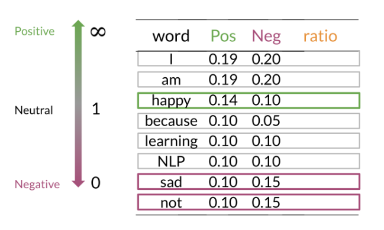
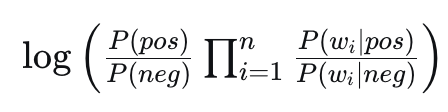
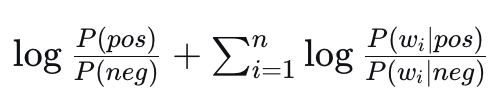
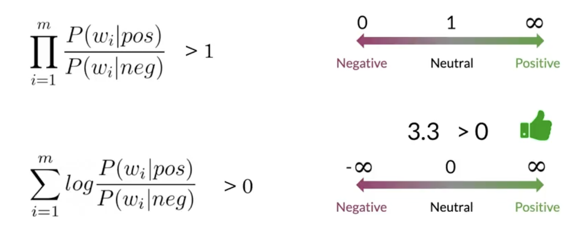

In this module, I will learn a new method for classification called Naive Bayes.
It is really useful because it's easy to train and provides a quick baseline for our tasks.

# 1. Probability & Bayes' rule

# 1.1 Conditional probabilities

Bayes' rule is applied in many fields including medicine, education, ...  
Imagine that we want to compute the probability of having a positive tweet in a corpus of tweets.

  

A = Positive tweet, we have to calculate P(A).  
- P(A) = Npos / N = 13/20 = 0.65 (65%)  
- P(Negative) = 1-P(Positive) = 0.35 (35%)

But there is a thing we have to consider: conditional probabilities.  
It's the way that a word considered as positive can appear in negative tweets.  

  

Here, the word "happy" appears to be positive, but it can also appear in negative tweets.  
For this, we first have to compute the total number of tweets that contain "happy" as B.

P(B) = P(happy) = Nhappy/N
P(B) = 4 / 20 = 0.2

Another way to look at it:  

  

So to compute the probability of two events happening, "happy" and "positive", we have to look at the intersection of both: happy ∩ positive = 15%

# 2. Bayes' rule 

In fact, conditional probabilities reduce the sample search space.
Example: we know the word is "happy".

Assuming we have : 
- P(Positive n "happy") as red circle  
- P("happy") as blue circle

Then, :
P(Positive|"happy") = P(Positive ∩ "happy") / P("happy")  
or
P(X|Y) = P(Y|X)P(X) / P(Y)

# 3. Naive Bayes model

## 3.1 Data preparation for Naive Bayes

The first step is to compute a frequency dictionary as in logistic regression,  
with appearance counts of positive and negative words.

  

## 3.2 Calculating conditional probabilities

This allows us to compute the probability of a word given a class (e.g., P("happy"|positive)). We calculate this by dividing the frequency of a word in a class by the total count of all words in that same class. This gives us a table of conditional probabilities.

If we sum all the probability values for a given class, they will sum to 1.

This table is powerful because it highlights which words are most indicative of a positive or negative sentiment based on the significant differences in their probabilities between the two classes.

  

Once we have these probabilities, we can compute a score for a given tweet to classify it.

A great way to visualize the sentiment of each word is to compute the **ratio** of its positive and negative probabilities.

  

We can interpret the ratio as follows:
- A ratio greater than 1 means the word is more likely to be found in positive tweets.
- A ratio less than 1 means the word is more likely to be found in negative tweets.
- A ratio of 1 means the word is neutral.

This gives us a clear table of the most influential words for each sentiment.

  

Note: It's common to ignore neutral words where the ratio of P(word|pos) to P(word|neg) is close to 1. A final score greater than 1 suggests a positive class, while a score less than 1 suggests a negative class.

# 4. Laplacian smoothing and log-likelihood (numerical stability)

## 4.1 The problem of zero probabilities

A major issue arises when a word appears in our test sentence but was not in the training vocabulary for a specific class.

For example, imagine the word "elated" is in a tweet we want to classify. If "elated" never appeared in a negative tweet in our training set, its frequency `freq("elated", neg)` would be 0.

The conditional probability `P("elated"|neg)` would therefore be 0.

  

When we calculate the overall score for the tweet, we multiply the probabilities of all its words. A single zero probability will cause the entire score for that class to become zero, which wrongly biases our classification and loses valuable information from other words.

## 4.2 The solution: Laplacian smoothing

To prevent zero probabilities, we use **Laplacian smoothing** (additive smoothing). We add a small constant `alpha` (commonly 1) to every word count.

To keep the probabilities for a class summing to 1, we also adjust the denominator by adding `alpha * V`, where `V` is the number of unique words in the overall vocabulary.

Key terms:
- `alpha`: smoothing constant (e.g., 1)
- `V`: vocabulary size (unique words across all classes)
- `N_class`: total word count in the class (sum over all words)

The updated conditional probability is:

  

  

This ensures no word ends up with probability 0.

## 4.3 Example: applying smoothing

Let's apply smoothing to both classes.

1) Compute smoothed probabilities for the **positive** class:

  

2) Do the same for the **negative** class:

  

  

## 4.4 Log-likelihood (avoiding underflow)

Multiplying many small probabilities can underflow to 0 in floating-point arithmetic. We avoid this by summing logarithms instead of multiplying probabilities:

`log(a * b) = log(a) + log(b)`

Applied to our context:

  
  →
  

# 4.5 Calculating lambda (decision score)

We use the log-ratio to score a tweet. For a word `w`:

`lambda(w) = log( P(w | pos) / P(w | neg) ) = log P(w | pos) - log P(w | neg)`

For a tweet with words `[w1, w2, ..., wk]`, the total score is the sum over words:

`Lambda(tweet) = Σ_i lambda(w_i)`

Decision rule:
- If `Lambda(tweet) > 0` → predict positive
- If `Lambda(tweet) < 0` → predict negative
- If `Lambda(tweet) = 0` → tie/neutral

Visually, lambda is the log-ratio:

  

  

So in the example below, the ratio for the word "happy" is:

`log(0.09 / 0.01)`

  

Remember: a word is "positive" contributor if `lambda(w) > 0`.

# 4.6 Log-likelihood decision rule

The tweet score is the sum of word-level log-ratios (lambdas). In other words, we use the log-likelihood ratio:

`Lambda(tweet) = Σ_i [ log P(w_i | pos) − log P(w_i | neg) ]`

Decision rule:
- If `Lambda(tweet) > 0` → predict positive
- If `Lambda(tweet) < 0` → predict negative
- If `Lambda(tweet) = 0` → tie/neutral

# 4.7 Recap

For tweet sentiment with Naive Bayes + logs, the threshold is 0 (not 1).  
We measure sentiment by the log-likelihood ratio (sum of word lambdas). A positive total favors the positive class; a negative total favors the negative class.

  

