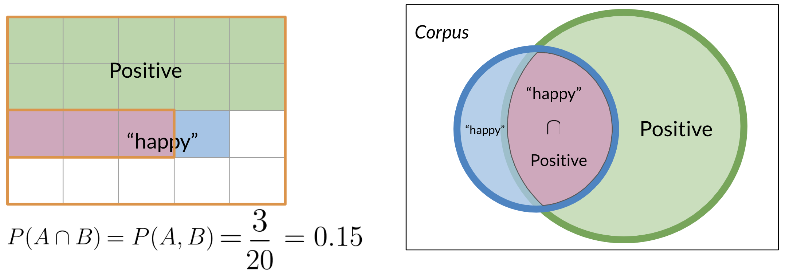

In this module, i will learn a new method for classification called Naive Bayes.
Is it really useful because it's easy to train and provide quick baseline for our tasks.

# 1. Probability & Baye's rule

Baye's rule is applied on many field including medecin, education, ...  
Imagine that we want to compute the probability of having a positive tweet on a corpus of tweets.

A = Positive tweet, we have to calcul P(A).  
- P(A) = Npos / N = 13/20 = 0.65 (65%)  
- P(Negative) = 1-P(Positive) = 0.35 (35%)

But, there is a thing we have to care : conditonnal propabilities.  
Its the way that a word considered as positive, can appears on a negative tweets.  

Here, the word happy appears to be positive, but it can appaears on negative tweets.  
For this, we first have to compute the total number of tweets that contains "happy" as B.

P(B) = P(happy) = Nhappy/N
P(B) = 4 / 20 = 0.2

Another way to looking at it :  

So to compute the probability of 2 events happening : "happy" & "positive", we have to look at the intersection of both : happy union positive = 15%