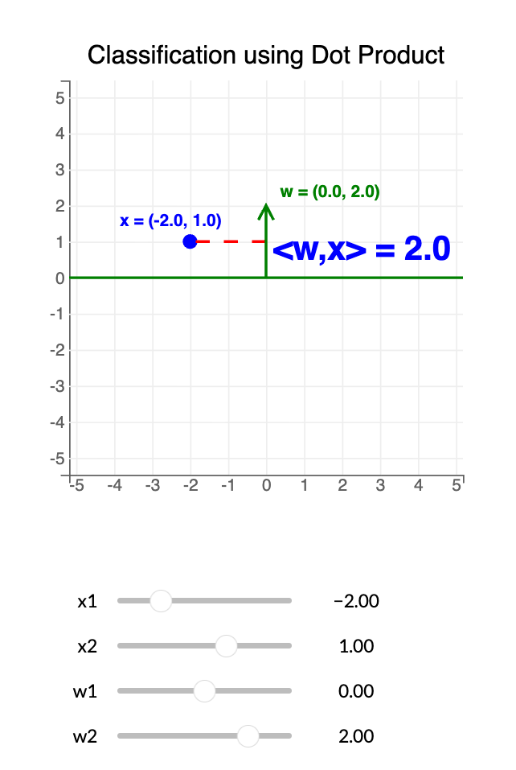
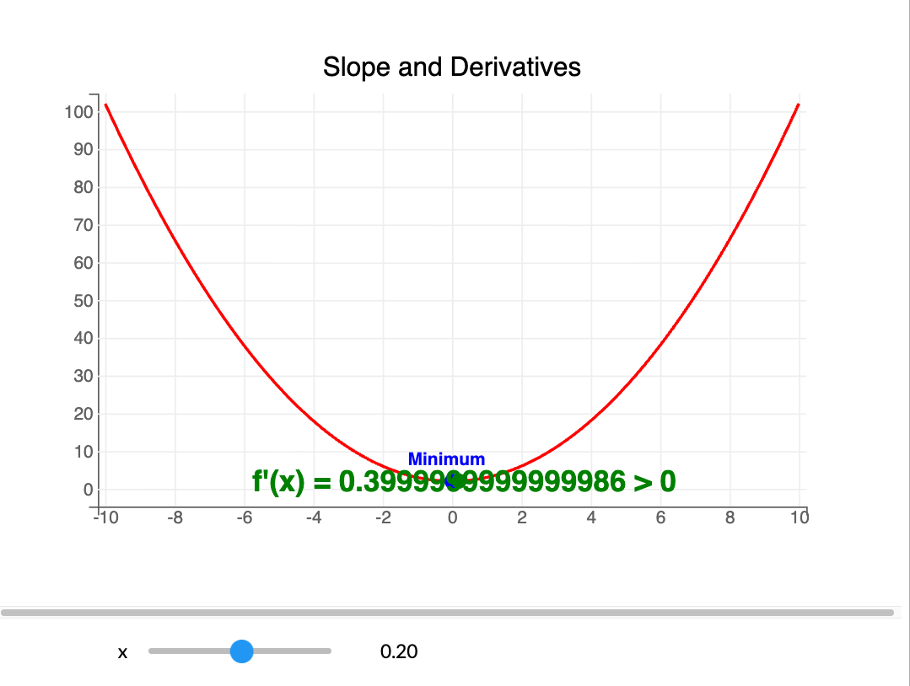
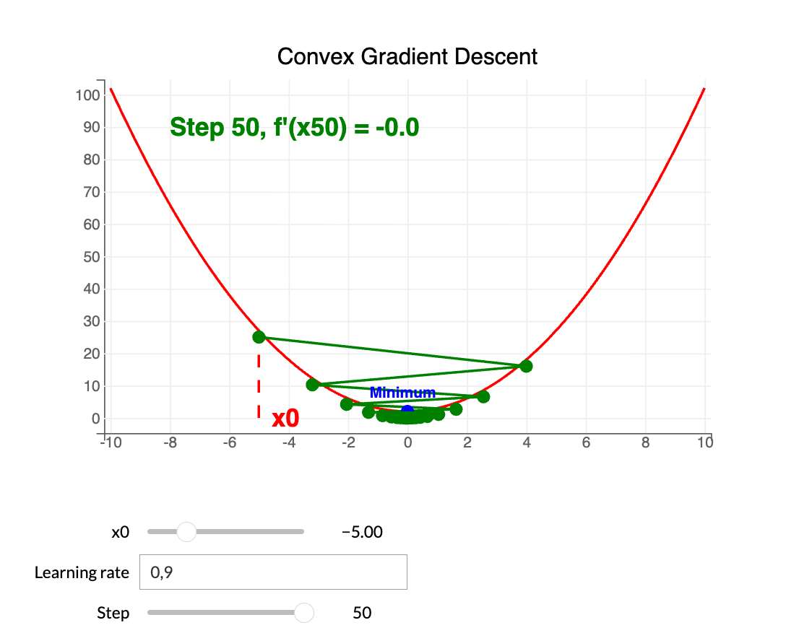

### Introduction

## DL vs ML

Deep learning is an evolution of traditional Machine Learning.
The more high-quality data we have, the better deep learning algorithms will perform.  
This is not always the case for traditional ML, which can stagnate after a certain level.

Deep learning is based on Artificial Neural Networks (ANN), inspired by how the human brain works.  

ML: Linear regression / Decision trees  
DL: Artificial Neural Networks (ANN)

ANNs can capture deeper patterns than traditional ML.  
Deep learning uses multiple layers; the more layers, the deeper the learned representation — hence the name "Deep Learning".  

  

Deep learning typically requires significant compute power.  

## Perceptron

Neural networks are built from layers.  
Each layer takes inputs and applies parameters to produce outputs.

A single neuron (perceptron) has:  
- a weight vector `w`  
- a bias `b`  
- an activation function `f`  

Dot product between \(w\) and \(x\):  
\[ w^\top x \,=\, \sum_{j=1}^{n} w_j x_j \]

For a given input vector \(x\), the perceptron output \(h\) is:  
\[ h \,=\, f\big(w^\top x + b\big) \]

  

In this example, the perceptron performs a linear model, most effective when data can be linearly separated.

## Dot product

The dot product drives the perceptron's decision.  

For a given point `x = (x_1, x_2)` and a vector `w = (w_1, w_2)`, classification is:  
- if `w^T x > 0` → class 1  
- if `w^T x < 0` → class 0  

The decision boundary (green line) is the set of points with `w^T x = 0`, separating positive from negative.

  

## Linear separability

To use dot products for classification, linear separability matters.  
Example: the Iris dataset using two variables: Sepal Width and Sepal Length.  

Goal: find a decision boundary to separate species.  
- Green: Iris setosa  
- Orange: Iris virginica  

  

This figure illustrates linear separability.  
The boundary line is the separating hyperplane, defined by:  
\[ \Big\{ x=(x_1,x_2)\in\mathbb{R}^2 : \langle x, w \rangle = x_1 w_1 + x_2 w_2 = 0 \Big\} \]

## Loss function

Above we identified a separating hyperplane visually. Now we define it mathematically.  

We count classification errors for a given `w`.  

Given `n` points `X = (x_i)_{i=1..n} ∈ R^d`  
and labels `Y = (y_i)_{i=1..n} ∈ {0,1}` corresponding to each `x_i`.  

Class 1: Iris setosa  
Class 0: Iris virginica  

Classifier with \(w\):
\[ f(x_i, w) \,=\, \mathbf{1}\big[\langle x_i, w\rangle \ge 0\big] \]

Empirical 0/1 loss:
\[ g(w, X, Y) \,=\, \sum_{i=1}^{n} \mathbf{1}\big[ f(x_i, w) \ne y_i \big] \]

We minimize this loss to find the best separating hyperplane.  

TensorFlow provides many loss functions for different problems:  

  

Examples related to Iris:  

  
  

## Activation function

A perceptron uses an activation function, which enables differentiable loss and appropriate outputs.  

Common activations:  
- Sigmoid  
- Tanh  
- ReLU (Rectified Linear Unit)  
- Leaky ReLU  

ReLU and Leaky ReLU are popular for hidden layers.  
The output layer activation depends on the problem:  
- binary classification: Sigmoid (probability of class 1)  
- multiclass classification: Softmax (class probabilities summing to 1)  
- regression: Linear (no activation)  

  

## Gradient descent

With differentiable activations, we can use gradient descent to optimize `w`.  

Gradient descent iterates to find (approximately) the `x_min` of a convex function, the point with minimal loss.  

Example: if \(f(x)=x^2\), then \(f'(x)=2x\).  

  
  

The step size between iterations is the learning rate \(\lambda\).  
We iterate until:  
\[ |f'(x_k)| \,<\, \text{tol} \] (with \(\text{tol}\) a small tolerance).  

Algorithm:  
- Step 0: choose initial point \(x_0\) and tolerance \(\text{tol}\)  
- Step k: while \(|f'(x_k)| \ge \text{tol}|\), update \(x_{k+1} = x_k - \lambda f'(x_k)\)

  

Limitations: vanilla gradient descent guarantees a global minimum only for convex functions.  
In DL, the loss is non-convex; gradient methods often reach a local minimum.  

Therefore, the learning rate is a critical hyperparameter for DL model performance. Finding a good learning rate is a key challenge.

  

