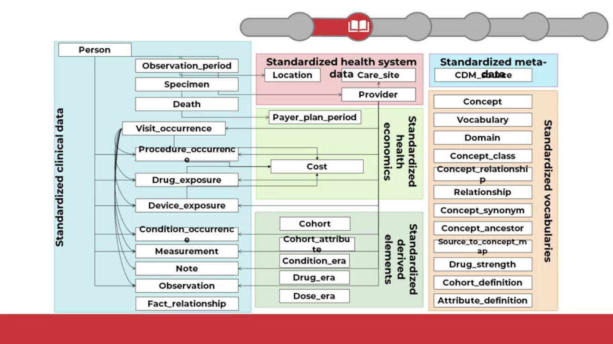

The new field of personalized medecine divide patients category into finer and finer categories, which is called clinical finatypes for personal diagnostic.

## Common data models 

CDM are built to normalize and make bigger databases across institutions to study some specifics diseases, tretement, etc...

Because all systems are built differently, so the querying and datas are different and means different things

A same data can be spelled differently across the same organizations and even between all world's organizations. So it was difficult to get all these datas to the same point.

That's why for this we used to make common data models, we specify a single location for the same datas can be stored, even across organizations  

Here, a list of most deployed common data models (open-source) for research:  
- i2b2: Harvard Univ  
- OMOP : OHDSI Consortium  
- Sentinel: USA FDA  
- PCORnet: Patient centered outcomes research institute  

It's good to precise here that it dont exist a single top 1 data models, all models have strenght and weakneasses, depending on how data are stored, asked, etc...  

## OMOP

OMOP is the model that is the most interesting for us because its the one which i work on, so i will study it.

OMOP have an extremely engaged and active user community and the documentation is well present.

OMOP = Observational Medical Outcomes Partnership  

OMOP is managed by OHDSI community = Observational Health Data sciences and informatics  , @ Columbia University in New York

### History

It was Started in 2008, by the US Food and Drug Administration (UFDA) in a goal of drug surveillance/adverse event detection.  

In 2014, it moved to OHDSI & the name was changed for OMOP.
It expanded to broad clinical researh and real world evidence generation.  

### Users

Due to its unique features of its design at the moment, it quickly gain a worldwide present (estimation of 1.4 billion individuals stored in omop database)  

### Features 

The strength of this model it its internation orientation and participation (multi-country terms, multiple hierarchy, ...)  
Extremely active online community & developed tools (focused on analytics)  

### Model  

Here is the OMOP data models (mostly relational):  

  

The multiple hierarchy and country terms are not really a problem.  

For example, terms like 'ICD-10' in english could change in an other language, like 'CIM-10' in French. So these terms are nrmalized into an international norms called 'SNOMED-CT'  

### Links 

Some links related to OMOP & OHDSI  

- Home URL : https://www.ohdsi.org/
- CDM URL : https://ohdsi.github.io/CommonDataModel/  
- ATLAS (OMOP analytics tool) : http://www.ohdsi.org/web/atlas/

