Personalized medicine divides patients into increasingly fine categories—clinical phenotypes—to enable tailored diagnosis and treatment.

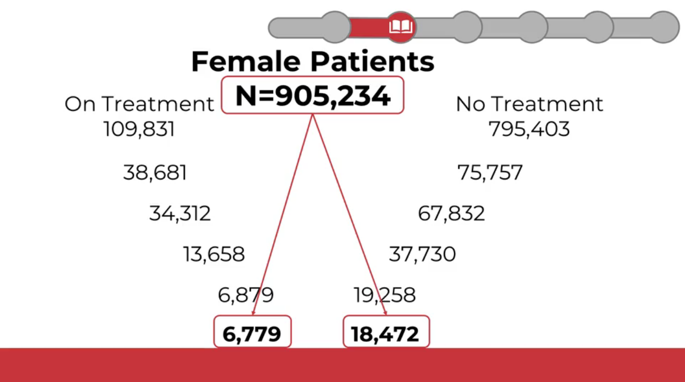

## Common data models

Common Data Models (CDMs) standardize healthcare data so multiple institutions can combine and analyze it for research on specific diseases, treatments, outcomes, and more.

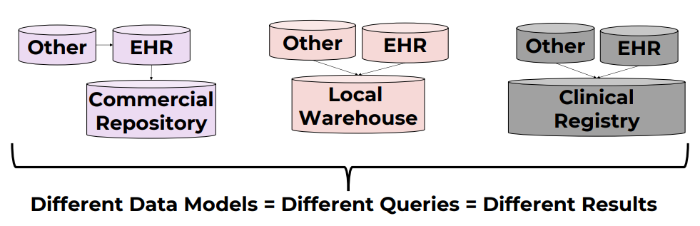

Healthcare systems store and label data differently. The same concept can be named in different ways even within a single organization, and certainly across countries. Without standardization, queries are inconsistent and data integration is hard.

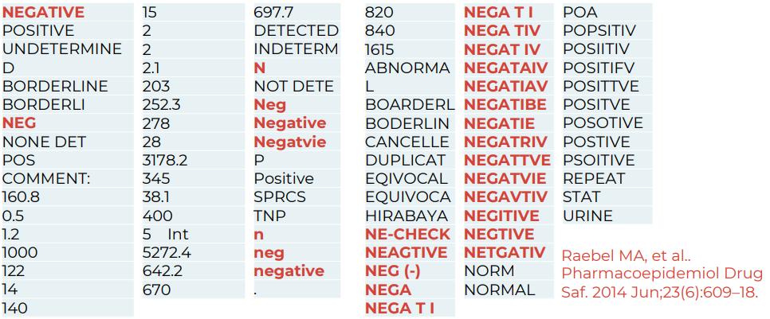

CDMs define common structures and fields so the same kinds of data live in the same place, regardless of source system.

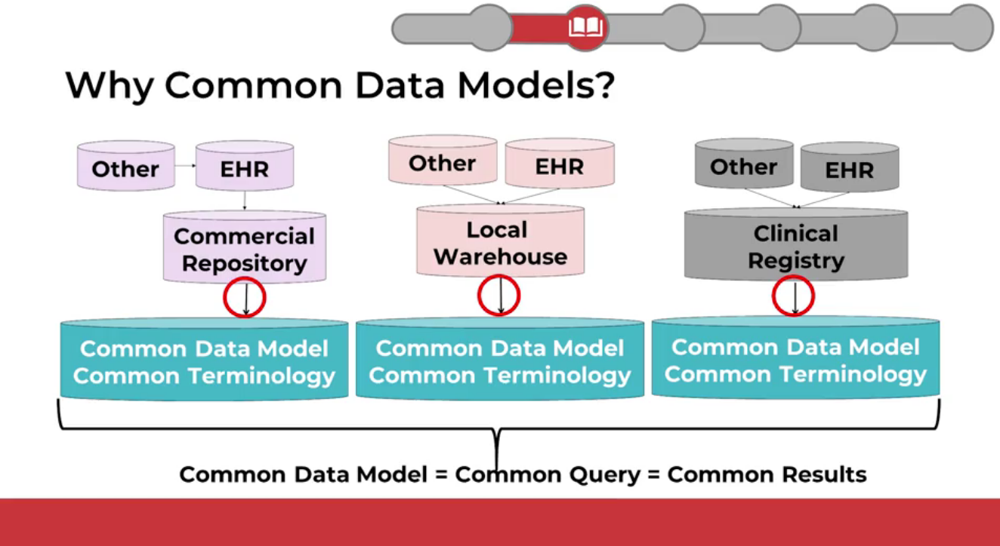

Widely used open-source research CDMs include:
- i2b2 (Harvard University)
- OMOP (by the OHDSI Consortium)
- Sentinel (U.S. FDA)
- PCORnet (Patient-Centered Outcomes Research Institute)

There is no single “best” CDM—each has strengths and trade-offs depending on your use case, data shape, and query patterns.

## OMOP

OMOP is the CDM I focus on here because I work with it regularly. It has an active community and solid documentation.

OMOP = Observational Medical Outcomes Partnership.

It is governed by the OHDSI community (Observational Health Data Sciences and Informatics) at Columbia University, New York.

### History

• 2008: initiated by the U.S. Food and Drug Administration (FDA) for drug safety surveillance and adverse event detection.

• 2014: transitioned to OHDSI. Scope expanded to broader clinical research and real‑world evidence generation.

### Adoption

OMOP has broad global adoption. Estimates suggest data for roughly 1.4 billion individuals have been mapped to OMOP worldwide.

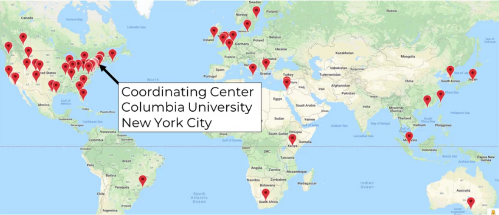

### Key features

- International orientation (multi-country, multi-terminology support; hierarchical vocabularies)
- Very active online community and ecosystem of analytics tools

### Data model

The OMOP CDM is primarily relational.

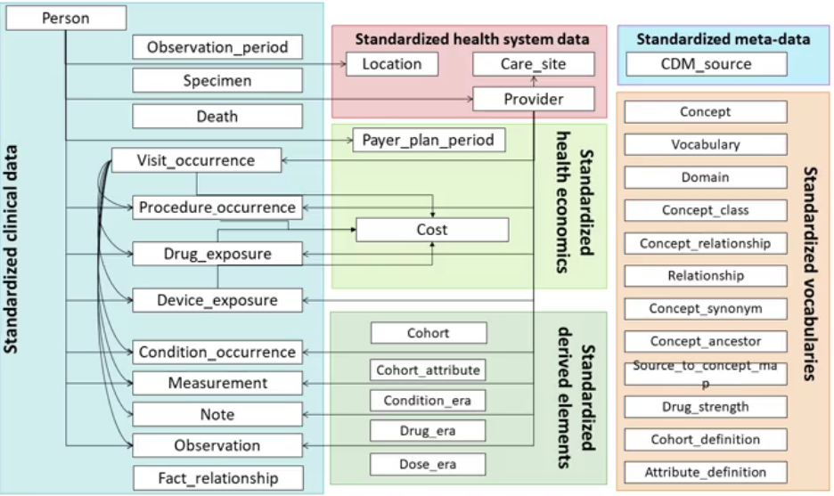

Terminology differences across languages and sources are handled via standardization. For example, ICD‑10 (English) vs CIM‑10 (French) are mapped to a common standard such as SNOMED CT.

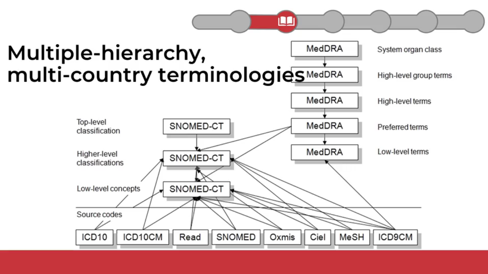

### Useful links

- OHDSI home: https://www.ohdsi.org/
- OMOP CDM docs: https://ohdsi.github.io/CommonDataModel/
- ATLAS (analytics tool): http://www.ohdsi.org/web/atlas/
- OMOP Vocabulary v5.0 (GitHub): https://github.com/OHDSI/Vocabulary-v5.0 — vocabulary release artifacts and versioning (use Athena to search/download content).

## Deep dive: OMOP CDM

DDL scripts to create the model are available here: [OHDSI/CommonDataModel](https://github.com/OHDSI/CommonDataModel). These SQL scripts create the standard tables of the OMOP CDM.

### OMOP model and conventions

- Blue: clinical data tables
- Green: classification/metadata tables
- Orange: vocabularies/terminologies

### Conceptual view

OMOP distinguishes two sides: source and standard.

**Source**
- Fields prefixed with `source_` (e.g., `source_value`, `source_concept_id`)
- Preserve original data values before standardization
- Useful for local queries that rely on local terms

**Standard**
- Fields that reference OMOP concepts (e.g., `concept_id`)
- Used by OHDSI tools and for cross‑site, standardized analytics

### Mapping

All source terms should be mapped to standard concepts. This allows multiple data sources to converge on a shared, community‑understood vocabulary.

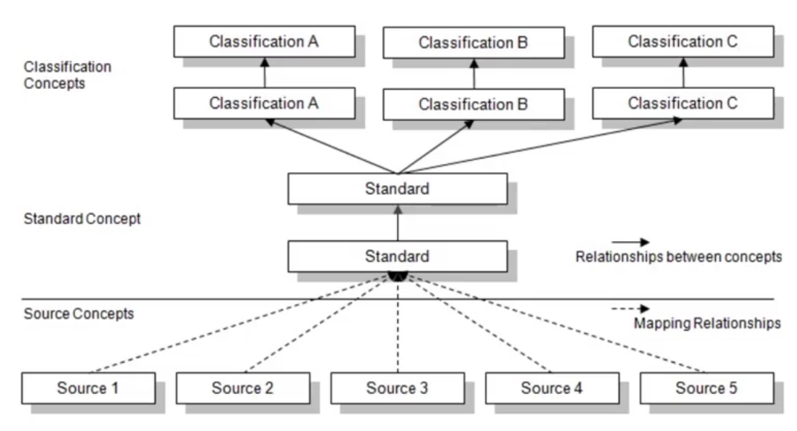

You can search and download OMOP standardized vocabularies and mappings in Athena (official OHDSI vocabulary portal): https://athena.ohdsi.org/search-terms/start

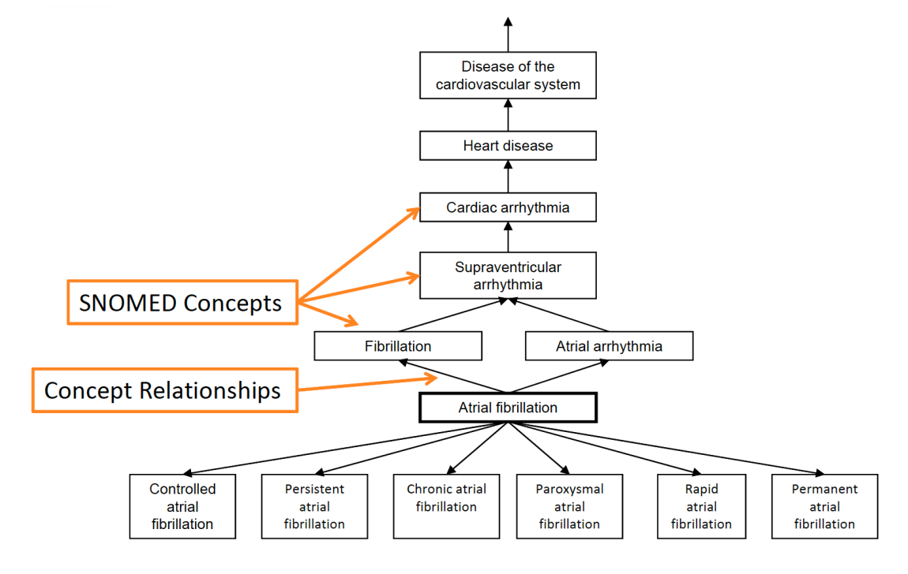
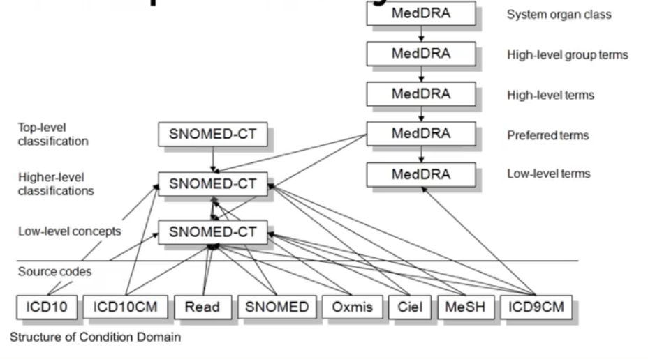

### Medical hierarchies

Hierarchical terminologies enable powerful roll‑ups and drill‑downs.

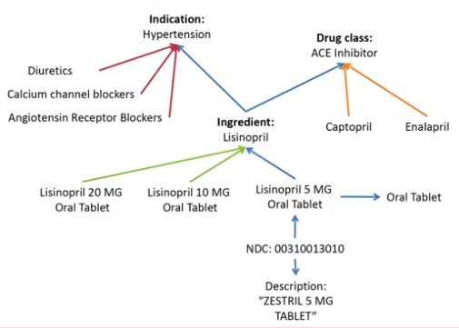

Example hierarchies:
- Indication: groups medications by the condition they treat
- Drug class: groups medications by mechanism of action

### Medication terminology

For medications, OMOP uses RxNorm as the primary standard, provided by the U.S. National Library of Medicine.

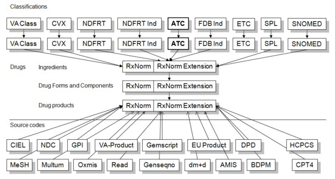

OMOP also includes additional medication hierarchies. One example is NDF-RT (National Drug File – Reference Terminology), which organizes medications by related diseases/indications.

### Why standardize with OMOP?

- Maintains mappings from non‑standard to standard concepts (e.g., ICD‑10‑CM → SNOMED CT)
- Classification concepts “fill in” relationships to underlying concepts; new concepts are automatically included in relevant classes
- Supports multiple hierarchies for flexible analytics

### Summary

- `SOURCE_VALUE`: original, unmodified values (useful for debugging; zero loss)
- `CONCEPT_ID`: standardized OMOP concept identifiers (enables local ↔ network harmonization)
- Hierarchies: standardized roll‑ups for consistent, cross‑site queries

### Querying the OMOP

Key concepts:
- `SOURCE_VALUE` / `SOURCE_CONCEPT_ID`: original source values (e.g., from MIMIC‑III). These preserve what was in the upstream system.
- `CONCEPT_ID`: standardized OMOP concept identifiers. Use these for standardized, cross‑site queries.
- `CONCEPT` table: the vocabulary dictionary that maps `concept_id` ↔ human‑readable names and related metadata.

- `CONCEPT_ANCESTOR` table: stores concept hierarchies, linking a higher‑level (parent/ancestor) concept to all of its descendant concepts for roll‑up queries.

OMOP uses broad, standardized table and field names so it can generalize across many health systems worldwide. A few examples:

- `VISIT_OCCURRENCE` = encounters/admissions/visits (table spec: https://ohdsi.github.io/CommonDataModel/cdm54.html#visit_occurrence)
- `CONDITION_OCCURRENCE` = diagnoses/conditions (table spec: https://ohdsi.github.io/CommonDataModel/cdm54.html#condition_occurrence)
- `DRUG_EXPOSURE` = medication prescribing/dispensing/administration (depending on the source) (table spec: https://ohdsi.github.io/CommonDataModel/cdm54.html#drug_exposure)

These umbrella names intentionally cover many similar events (e.g., external consults, urgent care, inpatient stays) under a single “visit” construct. The same idea applies to other domains.

Using hierarchies can drastically simplify queries: instead of listing hundreds or thousands of specific concepts, you can select a single ancestor `concept_id` and include all of its descendants via `CONCEPT_ANCESTOR`.