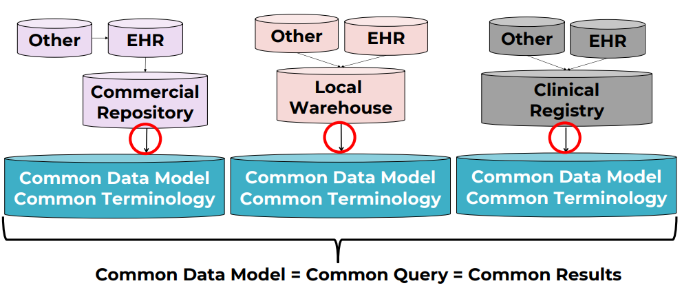
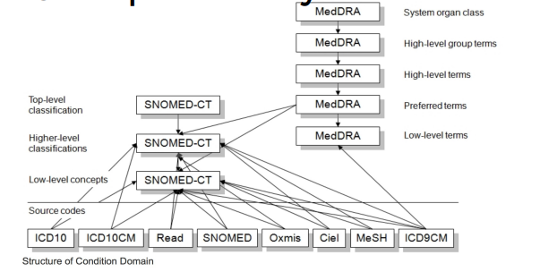

The new field of personalized medecine divide patients category into finer and finer categories, which is called clinical finatypes for personal diagnostic.

## Common data models 

CDM are built to normalize and make bigger databases across institutions to study some specifics diseases, tretement, etc...

Because all systems are built differently, so the querying and datas are different and means different things

A same data can be spelled differently across the same organizations and even between all world's organizations. So it was difficult to get all these datas to the same point.

That's why for this we used to make common data models, we specify a single location for the same datas can be stored, even across organizations  

Here, a list of most deployed common data models (open-source) for research:  
- i2b2: Harvard Univ  
- OMOP : OHDSI Consortium  
- Sentinel: USA FDA  
- PCORnet: Patient centered outcomes research institute  

It's good to precise here that it dont exist a single top 1 data models, all models have strenght and weakneasses, depending on how data are stored, asked, etc...  

## OMOP

OMOP is the model that is the most interesting for us because its the one which i work on, so i will study it.

OMOP have an extremely engaged and active user community and the documentation is well present.

OMOP = Observational Medical Outcomes Partnership  

OMOP is managed by OHDSI community = Observational Health Data sciences and informatics  , @ Columbia University in New York

### History

It was Started in 2008, by the US Food and Drug Administration (UFDA) in a goal of drug surveillance/adverse event detection.  

In 2014, it moved to OHDSI & the name was changed for OMOP.
It expanded to broad clinical researh and real world evidence generation.  

### Users

Due to its unique features of its design at the moment, it quickly gain a worldwide present (estimation of 1.4 billion individuals stored in omop database)  

### Features 

The strength of this model it its internation orientation and participation (multi-country terms, multiple hierarchy, ...)  
Extremely active online community & developed tools (focused on analytics)  

### Model  

Here is the OMOP data models (mostly relational):  

  

The multiple hierarchy and country terms are not really a problem.  

For example, terms like 'ICD-10' in english could change in an other language, like 'CIM-10' in French. So these terms are nrmalized into an international norms called 'SNOMED-CT'  

### Links 

Some links related to OMOP & OHDSI  

- Home URL : https://www.ohdsi.org/
- CDM URL : https://ohdsi.github.io/CommonDataModel/  
- ATLAS (OMOP analytics tool) : http://www.ohdsi.org/web/atlas/

## Deep dive into OMOP data model

We can found DDLs togenerate the model here : [OHDSI-CDM Github](https://github.com/OHDSI/CommonDataModel)  
They are Definitions and DDLs for the OMOP Common Data Model (CDM)  

DDL are multiple SQL lines which can build the standard tables of OMOP model.  

### OMOP Model & defs

- Blue part focus on store clinical datas  
- Green parts are focusing on storing class datas  
- Orange part focus on therminologies  

### Conceptual view  

There is 2 side of the OMOP Model.  
The 'source' and 'standard' ones.  

**Source** : We put anything into this side of the model  
- Any field that begins with 'source' like 'source_value', 'source_concept_id'
- Used to keep original data values before standardization 
- Can be usedfor local queries usinglocal terms  

**Standard** : Need to follow the standards set by OHDSI community  
- Any field that begins with 'concept'  
- All OHDSI tools & international queries use only this part of the model  

### Mapping

All source terms must be mapped to standard terms.  
The power of using mapping is that multi source can map their terms into one, single common standard term understood by the community.  

 

All terms of these models, are normalisation for all existent diseases.

### Medical hierarchies  

The power of medical terminologies hierarchy is shown here.  

  

The exemple got 2 differents hierarchy.
- Indication : combine multiple medications by a common indication
- Drug class : combine multiple medications by a common mechanism of action  

### Worldwide terminology  

The standard medication terminology used by OMOP is called RxNorm.  
It is an open-source terminology provided by the National Library of Medicine of USA.  

  

OMOP contain a large amount of medication hierarchy  
For our example we will use the NDFRT one on our queries  

NFDRT : National Drug File Reference Terminology  

It is an open-source drug terminlogy that provide multiple medication hierarchies  
In OMOP, it organize medication related to diseases they are used to treat.  

### Benefit to use OMOP standard  

OMOP maintains mappings from non-standard to standard concepts  
Eg: ICD10-CM to SNOMED-CT  

OMOP use a classification concept, OMOP "fills in" the underlying concepts
New concepts added : classification automaticly included  
More than one hierarchy allowed

### Resuming  

SOURCE_VALUE : stores original values  
- useful for debugging, zero loss
CONCEPT_IDs : stores OMOP defined standard value  
- Harmonization local<->network  
Hierarchies : OMOP defined standard values  
- Allows standardized queries 
