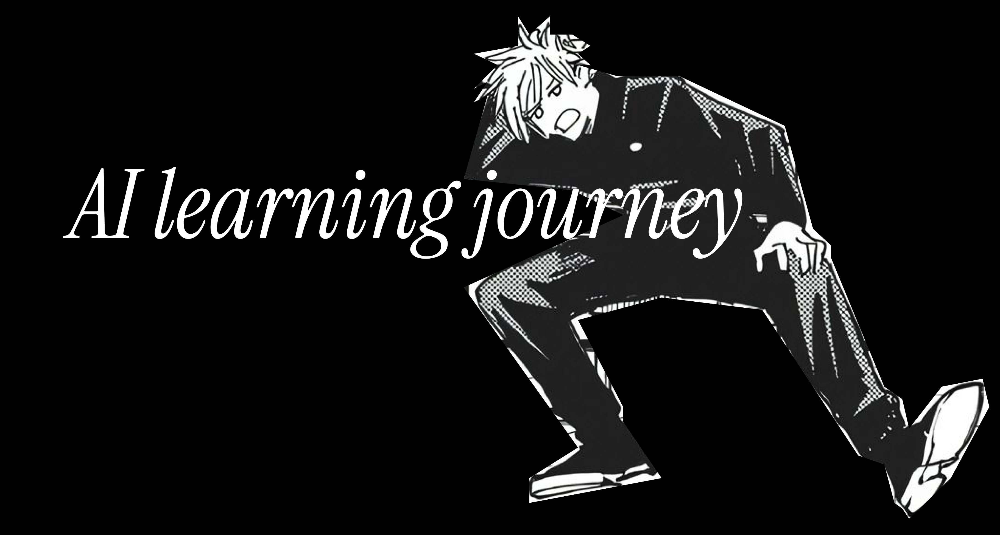

  

Confession; I'm not the most motivated student, so I built this repo to force myself to show up regularly—notes, visuals, and small wins, one commit at a time. Join me as I explore, experiment, and build! :)

This repository documents my progress through the different fields of AI.

## Learning Modules

***[WIP]*** **Natural Language Processing** : 
- [Sentiment Analysis with Logistic Regression](https://spideystreet.github.io/ai-learning-journey/03-nlp/03.1-sentiment-analysis-with-logitic-regression/notes.html)  
- [Sentiment Analysis with Naive Bayes](https://spideystreet.github.io/ai-learning-journey/03-nlp/03.2-sentiment-analysis-with-naive-bayes/notes.html)  

***[WIP]*** **Deep Learning** : 
- [Deep Learning: Dense neural network](https://spideystreet.github.io/ai-learning-journey/04-deep-learning/151.1-dense-neural-network.html)

*(More modules will be added as I progress.)*

## Papers

You can find research papers i read and sometimes took notes on: [Papers](papers/)

## Connect with Me

<a href="https://x.com/spideystreet" target="_blank"> 

## License

The content of this repository is licensed under the terms of the [LICENSE](./LICENSE) file.

---

  Made with ❤ by <a href="https://github.com/spideystreet">spidey</a>, your friendly friend
   
